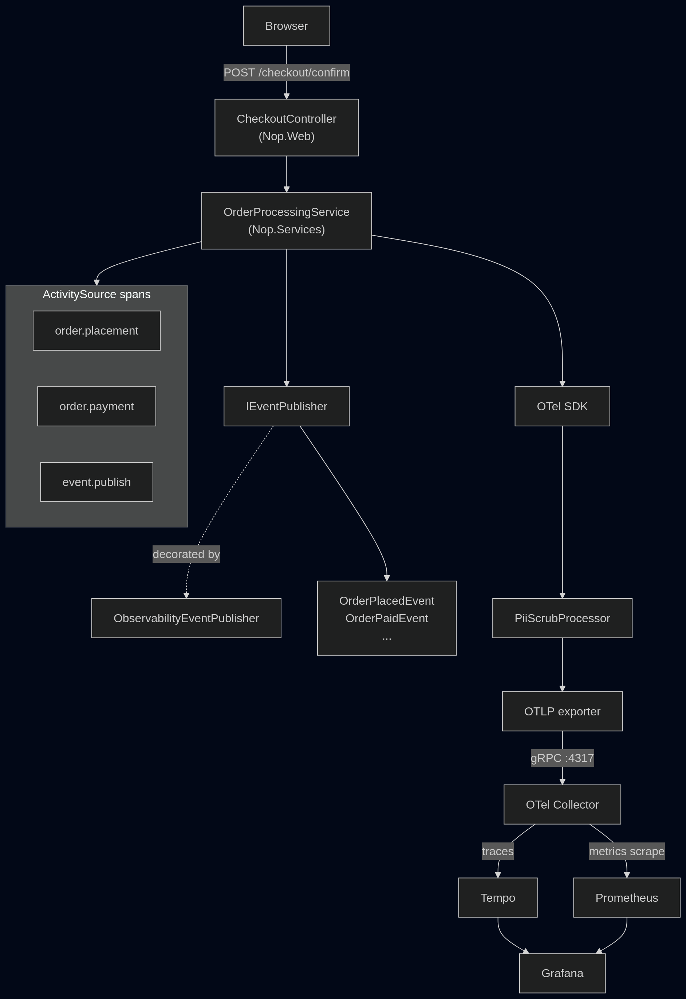
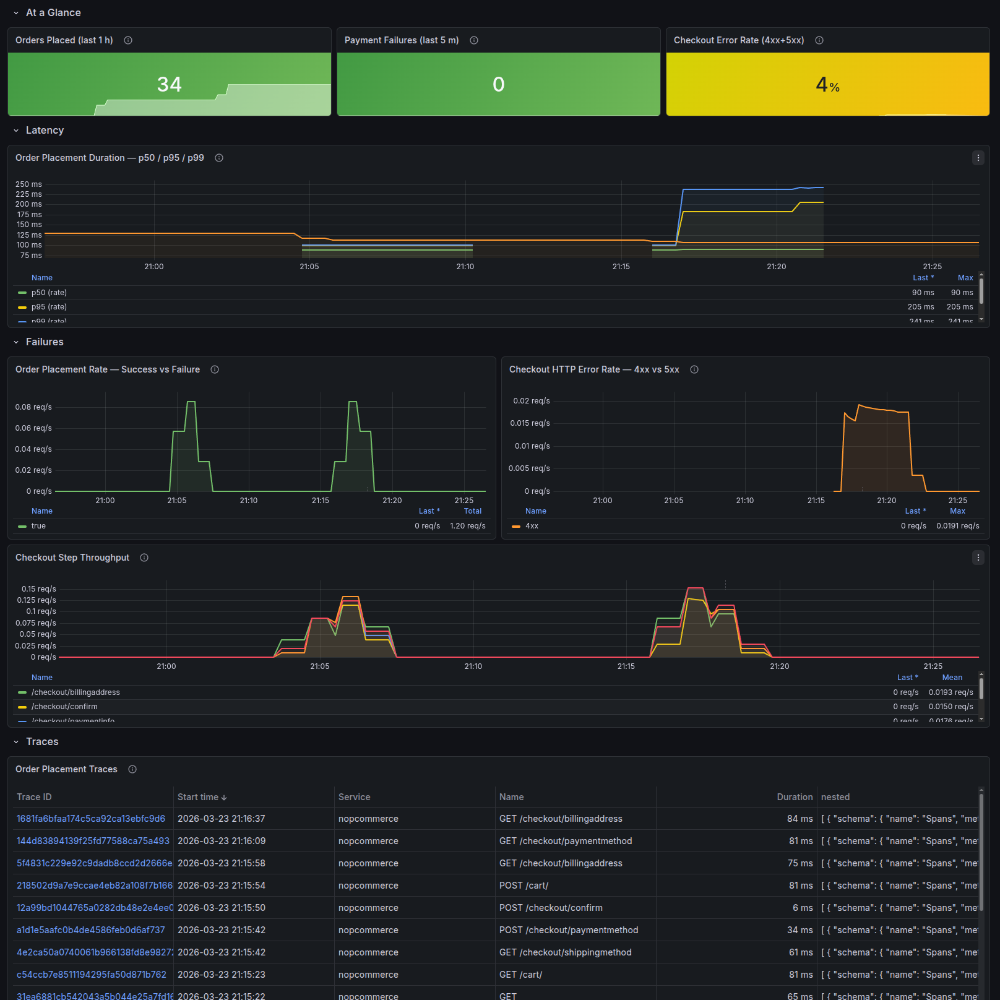

# nopCommerce + OpenTelemetry — Assignment 01

> Software Architectures · Master in Informatics Engineering
> Fork of [nopSolutions/nopCommerce](https://github.com/nopSolutions/nopCommerce) with end-to-end observability instrumentation.

---

## What Was Added

This fork instruments the **order placement flow** with OpenTelemetry. Every customer checkout — from `POST /checkout/confirm` through payment processing to database persistence — produces distributed traces, custom metrics, and a Grafana dashboard.

| Deliverable | Location |
|---|---|
| Instrumentation critique | [`CRITIQUE.md`](CRITIQUE.md) |
| Grafana dashboard JSON | [`observability/grafana/dashboards/`](observability/grafana/dashboards/) |
| k6 load test | [`loadtest/checkout-flow.js`](loadtest/checkout-flow.js) |
| OTel startup config | [`src/Presentation/Nop.Web.Framework/Infrastructure/ObservabilityStartup.cs`](src/Presentation/Nop.Web.Framework/Infrastructure/ObservabilityStartup.cs) |

---

## Architecture



### Layer Stack

```
Nop.Web  →  Nop.Web.Framework  →  Nop.Services  →  Nop.Data  →  Nop.Core
```

New files added:

| File | Layer | Purpose |
|---|---|---|
| `Nop.Services/Observability/NopActivitySource.cs` | Services | Shared `ActivitySource` + `Meter` + metrics definitions |
| `Nop.Services/Events/ObservabilityEventPublisher.cs` | Services | `IEventPublisher` decorator — wraps every event publish with a span |
| `Nop.Web.Framework/Observability/PiiScrubProcessor.cs` | Framework | `BaseProcessor<Activity>` — strips PII attributes before OTLP export |
| `Nop.Web.Framework/Infrastructure/ObservabilityStartup.cs` | Framework | OTel SDK registration (TracerProvider + MeterProvider) |

---

## Quick Start

### Prerequisites

- [Docker](https://docs.docker.com/get-docker/) + Docker Compose v2
- Ports 80, 3000, 4317, 9090, 3200 free

### 1. Clone and start

```bash
git clone <your-fork-url>
cd AS01-nopCommerce
docker compose up -d --build
```

The first start takes 3–5 minutes. nopCommerce will run the store wizard on first boot.

### 2. First-time store setup

1. Open `http://localhost` in your browser
2. Follow the installation wizard:
   - **Database:** SQL Server, server `nopcommerce_mssql_server`, user `sa`, password `nopCommerce_db_password`
   - Fill in store name and admin credentials
3. Wait for setup to complete (~2 min)

### 3. Verify observability stack

| Service | URL | Credentials |
|---|---|---|
| nopCommerce | `http://localhost` | (your store admin) |
| Grafana | `http://localhost:3000` | admin / admin |
| Prometheus | `http://localhost:9090` | — |
| Tempo | `http://localhost:3200` | — |

### 4. Run the load test

```bash
# Install k6: https://k6.io/docs/get-started/installation/
k6 run loadtest/checkout-flow.js
```

Available scenarios (set via environment variable):

```bash
k6 run -e SCENARIO=smoke  loadtest/checkout-flow.js   # 1 VU, 1 min  (default)
k6 run -e SCENARIO=load   loadtest/checkout-flow.js   # ramp to 10 VUs, 14 min
k6 run -e SCENARIO=stress loadtest/checkout-flow.js   # ramp to 50 VUs, 30 min
k6 run -e SCENARIO=demo   loadtest/checkout-flow.js   # 3 good VUs + 1 bad VU, 2 min
```

### 5. Open the dashboard

Go to `http://localhost:3000` → **Dashboards** → **nopCommerce Order Flow**.

---

## Instrumentation Details

### Traces

Every `POST /checkout/confirm` request produces a trace with three nested spans:

```
HTTP POST /checkout/confirm           (ASP.NET Core auto-instrumentation)
  └── order.placement                 (OrderProcessingService.PlaceOrderAsync)
        └── order.payment             (payment plugin call)
              └── event.publish       (ObservabilityEventPublisher — per-event)
```

**Safe span attributes** (no PII):
`order.id`, `order.customer_id`, `order.status`, `order.payment_status`, `order.total`, `order.store_id`

**Stripped by `PiiScrubProcessor`**:
`CardNumber`, `CardCvv2`, `Email`, `FirstName`, `LastName`, `PhoneNumber`, `Address1`, `CustomerIp`

### Custom Metrics

| Metric | Type | Description |
|---|---|---|
| `order.placement.duration` (ms) | Histogram | End-to-end order placement latency. Operational use: rising p95 signals checkout pipeline degradation before users start seeing timeouts. |
| `order.payment.failures` | Counter | Payment processing failures tagged by error reason. Operational use: distinguishes gateway outages (all errors the same) from declined cards (varied). |

### Grafana Dashboard



Panels:

1. **Orders Placed (last 1 h)** — `max(order_placement_duration_ms_count)` stat
2. **Payment Failures** — `max(order_payment_failures_total)` stat
3. **Checkout Error Rate (4xx+5xx)** — fraction of checkout requests returning errors
4. **Order Placement Duration p50/p95/p99** — `histogram_quantile(...)` timeseries
5. **Order Placement Rate — Success vs Failure** — throughput split by outcome
6. **Checkout Step Throughput** — request rate per checkout route (funnel view)
7. **Checkout HTTP Error Rate — 4xx vs 5xx** — error breakdown by class
8. **Order Placement Traces** — Tempo trace panel (TraceQL search on service `nopcommerce`)

---

## Resetting the Environment

If the database needs to be recreated:

```bash
docker compose down -v          # removes all volumes including DB
docker compose up -d --build    # rebuild and restart
# re-run store wizard at http://localhost
```

If nopCommerce fails to connect after MSSQL recreation, the stale config file needs clearing:

```bash
docker exec nopcommerce rm -f /app/App_Data/appsettings.json
docker restart nopcommerce
```

---

## Load Test Results (reference run)

| Scenario | VUs | Duration | Orders placed | Success rate | p95 latency |
|---|---|---|---|---|---|
| smoke | 1 | 1 min | 1 | 100% | ~120 ms |
| load | 10 | 14 min | 214 | 100% | 119 ms |

All HTTP requests: 0% failure rate. All 18 checkout checks passing at 100%.
